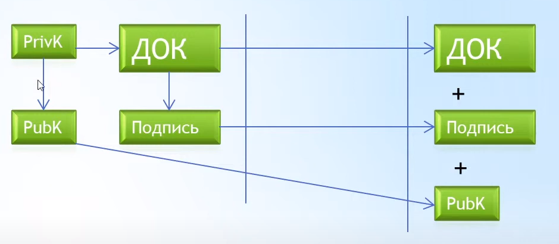

# Описание числовой подписи

Этот документ определение и способ использования числовой подписи

## Назначение

Числовая подпись нужна для того чтобы можно было подписать документ (файл с данными). Файл может быть любой. 
Подпись генерируется на каждый процесс подписи и каждый раз она уникальна. 
Для того чтобы сформировать подпись необходима библиотека которая генерирует приватный ключ (PrivK).
Далее при помощи библиотеки получаем публичный адрес из приватного ключа (PubK) - он всегда постоянный и открытый (свободно распространяемый) вне зависимости от количества вызовов.
Далее при помощи библиотеки делаем подпись документа. Подпись всегда уникальна на каждый вызов подписи одного и того же документа одним и тем же приватным ключом (PrivK).

Для того чтобы проверяющая сторона могла проверить подпись ей нужен документ, публичный ключ (PubK) и сама подпись.
При помощи библиотеки можно это проверить. Она выдаст ИСТИНА (TRUE) только в одном случае, если именно этот документ подписал именно обладатель приватного ключа (PrivK) на основе которого был сформирован публичный ключ (PubK).
В других случаях она выдаст ЛОЖЬ (FALSE) что означает что или документ был изменен или подпись не того человека. Определить что именно можно только если получится получить TRUE от исходных правильных данных. 

Существует несколько алгоритмов числовой подписи. Мы используем https://github.com/BitcoinPHP/BitcoinECDSA.php. Версия `1.3.4`. Ссылка https://api.github.com/repos/BitcoinPHP/BitcoinECDSA.php/zipball/b8859651a40a029a93a174b60abf6d33e6691561.

## Что собой из себя представляет числовая подпись?

Числовая подпись представляет из себя строку набора символов. Например `IC2WCCd67twgWp6lMJL00cHWeUtH9bwhRmzN0N8Pu4OmRXoOfAz71t9toXVJThHh2GtprXKo6Jt0yhxcMRoJSV0=`.

Приватный ключ представляет из себя строку набора символов. Например `896d3c32dd5d6eac08720fdb5d413673fc043d474186a13013ab62a2d3640919`. По сути это секретный пароль который является уникальным для каждого человека.

Публичный ключ представляет из себя строку набора символов. Например `19qyEp5KSPu7cCuEaPzTjzoRTkGDSJGJn`.

## Способ использования

В виду того что подпись документов числовой подписью является действием которое подтверждает кто именно сделал такую подпись, то критически важным является сохранение приватного ключа. 
Так как числовую подпись можно проверить без приватного ключа, то лучшей практикой будет генерировать числовую подпись на своем компьютере и отправлять уже саму числовую подпись в систему или партнеру.