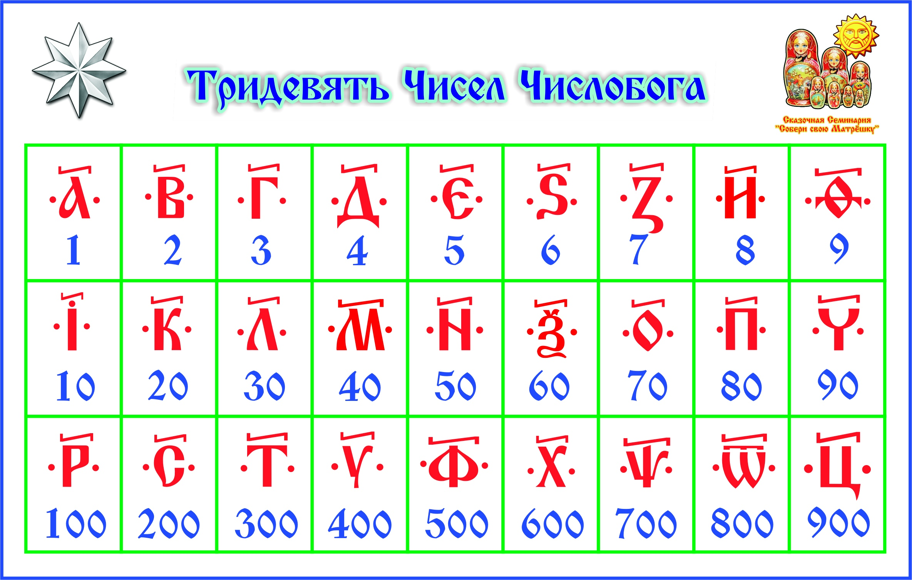

# БОСТ №000008-7528 Об отображении чисел во вселенной ЯАватар (Тридевятое царство)

Короткое название стандарта: Тридевятое царство.

В связи с тем что числа (они же знаки и символы) влияют на пространство вибрационным способом то мы 
используем те символы которые нам передали предки.

Для отображения числел во вселенной ЯАватар, действет следующая таблица:

